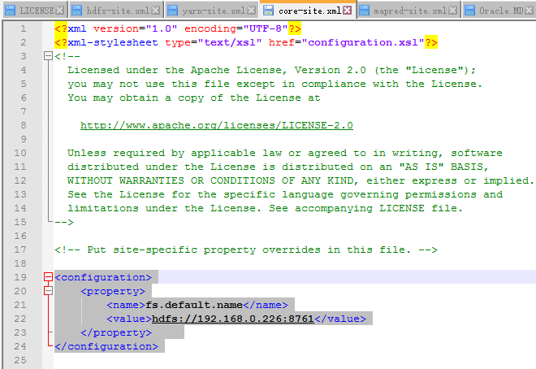
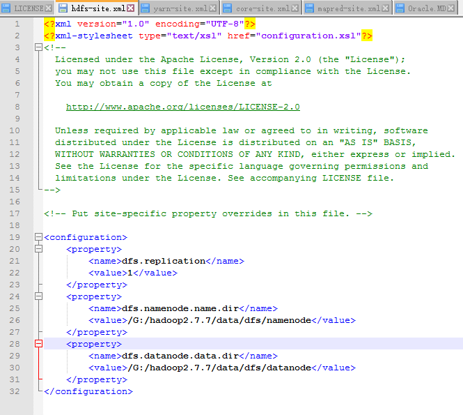
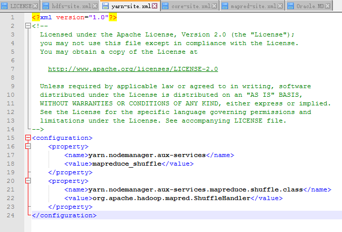
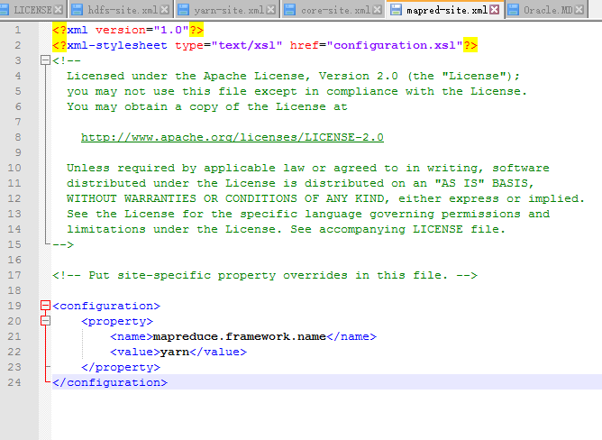

## 第一步：安装java运行环境jdk1.8 ##

1. 安装玩jdk，jre，并配置java环境变量

2. 配置hadoop环境变量

    新建变量名：`HADOOP_HOME`

    输入路径：`G:\hadoop2.7.7`

    在path中最前面加上：%HADOOP_HOME%\bin;%HADOOP_HOME%\sbin;

3. 确认hadoop配置的jdk的路径
 
    在hadoop-2.7.3\etc\hadoop找到hadoop-env.cmd
    右键用一个文本编辑器打开

    set JAVA_HOME=%JAVA_HOME%，这里的hadoop不支持带有空格的jdk路径，我这里安装没有空格，故未做更改，如jdk安装路径有空格，可以尝试如下操作：

    如果路径中有“Program Files”，则将Program Files改为 PROGRA~1

## hadoop环境验证 ##

在cmd中运行hadoop version

    Hadoop 2.7.7
    Subversion Unknown -r c1aad84bd27cd79c3d1a7dd58202a8c3ee1ed3ac
    Compiled by stevel on 2018-07-18T22:47Z
    Compiled with protoc 2.5.0
    From source with checksum 792e15d20b12c74bd6f19a1fb886490
    This command was run using /G:/hadoop2.7.7/hadoop-2.7.7/share/hadoop/common/hadoop-common-2.7.7.jar

## hadoop核心配置文件 ##

- hadoop-2.7.7/etc/hadoop/core-site.xml

- hadoop-2.7.7/etc/hadoop/hdfs-site.xml

- hadoop-2.7.7/etc/hadoop/yarn-site.xml

- hadoop-2.7.7/etc/hadoop/mapred-site.xml

- 

## 格式化 HDFS ##

   以管理员身份打开命令提示符
   输入`hdfs namenode -format`执行到如下图所示

    SHUTDOWN_MSG: Shutting down NameNode at PC-20181230ZAIL/192.168.28.1

在这之前需要将winutils\hadoop-2.7.7下的dll替换到hadoop的bin目录下，还有将hadoop.dll复制到系统目录下

## 启动 ##

在hadoop-2.7.7\sbin目录下启动start-all.cmd,然后通过jps命令查看启动的java进程如下：

    13620 ResourceManager
    14788 Jps
    12264 NameNode
    13912 NodeManager
    3980 DataNode
## 使用 ##

- 显示目录

   hadoop fs -ls hdfs://localhost:9999/

- 检测hadoop运行状态信息

　　hadoop dfsadmin -report　　打印出hadoop中硬盘的使用信息

- 删除文件

hadoop dfs -rm hdfs://localhost:9999/hdfs9999/1.MD
DEPRECATED: Use of this script to execute hdfs command is deprecated.
Instead use the hdfs command for it.
19/04/25 11:16:52 INFO fs.TrashPolicyDefault: Namenode trash configuration: Deletion interval = 0 minutes, Emptier interval = 0 minutes.
Deleted hdfs://localhost:9999/hdfs9999/1.MD

- 删除文件夹

hadoop fs -rm -r -skipTrash hdfs://localhost:9999/hdfs9999
Deleted hdfs://localhost:9999/hdfs9999

-  hadoop中创建归档文件

　　hadoop archive -archiveName example.har -p /tmp/input dir1 dir2 -r 2 /tmp/output/

　　其中example.har为hadoop中归档文件的特殊格式，-p指定父目录，dir1和dir2为需要归档的文件夹，-r指定了复制的份数，最后为结果输出目录

-  hadoop安全模式

　　hadoop dfsadmin -safemode enter | leave | get | wait

　　分别表示进入，离开，获取信息，等待

　　分布式文件系统刚启动或者datanode汇报给namenode的块信息与namenode中的元数据不同比例超过阀值时，hadoop会进入安全模式。安全阀值由配置项dfs.safemode.threshold.pct来确定。

　　默认为0.999。系统处于安全模式中时，不允许对文件进行修改或删除。
 

-  hadoop 将文件内容追加到hdfs上

　　hadoop dfs -appendToFile localfile1 /tmp/output/file2

　　hadoop dfs -appendToFile localfile1 localfile2 /tmp/output/file3